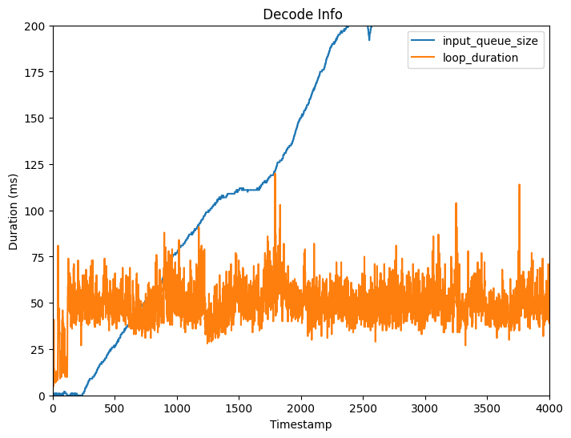
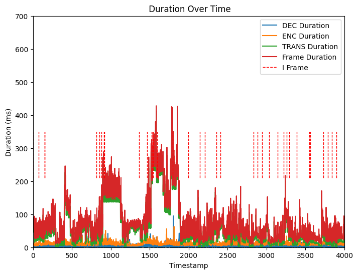
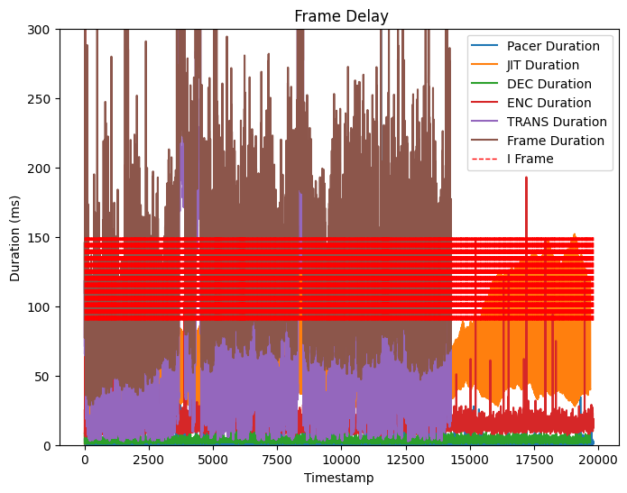

# 端到端视频传输
## 一、运行
### 1.启动发送端 
cd aiortc
python3 ./examples/videostream-cli/cli.py offer --play-from ./dataset/test.mp4
运行产生offer，默认交换SDP的模式是复制粘贴，需手动复制offer粘贴到接收端
{"sdp": "v=0\r\no=- 3910748632 3910748632 IN IP4 0.0.0.0\r\ns=-\r\nt=0 0\r\na=group:BUNDLE 0\r\na=msid-semantic:WMS *\r\nm=video 61128 UDP/TLS/RTP/SAVPF 97 98 99 100 101 102\r\nc=IN IP4 172.19.240.1\r\na=sendrecv\r\na=extmap:1 urn:ietf:params:rtp-hdrext:sdes:mid\r\na=extmap:3 http://www.webrtc.org/experiments/rtp-hdrext/abs-send-time\r\na=mid:0\r\na=msid:db6d556e-4b65-43dc-9b65-c5842ff7d7d0 9964603f-35ce-4037-9107-79cef798f53f\r\na=rtcp:9 IN IP4 0.0.0.0\r\na=rtcp-mux\r\na=ssrc-group:FID 3801919459 2472625064\r\na=ssrc:3801919459 cname:4f80c0c7-36c8-4f3a-9896-2c7157606068\r\na=ssrc:2472625064 cname:4f80c0c7-36c8-4f3a-9896-2c7157606068\r\na=rtpmap:97 VP8/90000\r\na=rtcp-fb:97 nack\r\na=rtcp-fb:97 nack pli\r\na=rtcp-fb:97 goog-remb\r\na=rtpmap:98 rtx/90000\r\na=fmtp:98 apt=97\r\na=rtpmap:99 H264/90000\r\na=rtcp-fb:99 nack\r\na=rtcp-fb:99 nack pli\r\na=rtcp-fb:99 goog-remb\r\na=fmtp:99 level-asymmetry-allowed=1;packetization-mode=1;profile-level-id=42001f\r\na=rtpmap:100 rtx/90000\r\na=fmtp:100 apt=99\r\na=rtpmap:101 H264/90000\r\na=rtcp-fb:101 nack\r\na=rtcp-fb:101 nack pli\r\na=rtcp-fb:101 goog-remb\r\na=fmtp:101 level-asymmetry-allowed=1;packetization-mode=1;profile-level-id=42e01f\r\na=rtpmap:102 rtx/90000\r\na=fmtp:102 apt=101\r\na=candidate:84525827d984b903f6250bb33f1836c3 1 udp 2130706431 172.19.240.1 61128 typ host\r\na=candidate:a794a0b8ea98fb9d35a09b0aa6852435 1 udp 2130706431 192.168.31.22 61129 typ host\r\na=candidate:4bc0bb2f32cea4d0dad824a6fa6164d4 1 udp 1694498815 115.156.132.20 61129 typ srflx raddr 192.168.31.22 rport 61129\r\na=end-of-candidates\r\na=ice-ufrag:tAct\r\na=ice-pwd:DxwfHDfHXgNeUJgZVFxeTG\r\na=fingerprint:sha-256 FB:60:A0:E7:20:D7:C6:2A:CC:5B:00:3F:F6:0D:EC:05:D6:A7:FF:03:4D:4A:DC:60:F0:2D:DB:C5:71:F9:54:86\r\na=setup:actpass\r\n", "type": "offer"}
offer信息解读：


### 2. 启动接收端
cd aiortc
python3 ./examples/videostream-cli/cli.py answer --record-to ./receive_data/video.mp4
将发送端产生的offer粘贴在终端，产生answer

{"sdp": "v=0\r\no=- 3910748693 3910748693 IN IP4 0.0.0.0\r\ns=-\r\nt=0 0\r\na=group:BUNDLE 0\r\na=msid-semantic:WMS *\r\nm=video 59269 UDP/TLS/RTP/SAVPF 97 98 99 100 101 102\r\nc=IN IP4 172.19.240.1\r\na=sendrecv\r\na=extmap:1 urn:ietf:params:rtp-hdrext:sdes:mid\r\na=extmap:3 http://www.webrtc.org/experiments/rtp-hdrext/abs-send-time\r\na=mid:0\r\na=msid:7a3706e2-10e7-4b75-aad6-22db48fd7e3d 4e618f8f-b68a-446f-a913-b4959abfe64c\r\na=rtcp:9 IN IP4 0.0.0.0\r\na=rtcp-mux\r\na=ssrc-group:FID 2317366329 1460064368\r\na=ssrc:2317366329 cname:4830261d-175a-4378-9833-4492f107983f\r\na=ssrc:1460064368 cname:4830261d-175a-4378-9833-4492f107983f\r\na=rtpmap:97 VP8/90000\r\na=rtcp-fb:97 nack\r\na=rtcp-fb:97 nack pli\r\na=rtcp-fb:97 goog-remb\r\na=rtpmap:98 rtx/90000\r\na=fmtp:98 apt=97\r\na=rtpmap:99 H264/90000\r\na=rtcp-fb:99 nack\r\na=rtcp-fb:99 nack pli\r\na=rtcp-fb:99 goog-remb\r\na=fmtp:99 level-asymmetry-allowed=1;packetization-mode=1;profile-level-id=42001f\r\na=rtpmap:100 rtx/90000\r\na=fmtp:100 apt=99\r\na=rtpmap:101 H264/90000\r\na=rtcp-fb:101 nack\r\na=rtcp-fb:101 nack pli\r\na=rtcp-fb:101 goog-remb\r\na=fmtp:101 level-asymmetry-allowed=1;packetization-mode=1;profile-level-id=42e01f\r\na=rtpmap:102 rtx/90000\r\na=fmtp:102 apt=101\r\na=candidate:84525827d984b903f6250bb33f1836c3 1 udp 2130706431 172.19.240.1 59269 typ host\r\na=candidate:a794a0b8ea98fb9d35a09b0aa6852435 1 udp 2130706431 192.168.31.22 59270 typ host\r\na=candidate:4bc0bb2f32cea4d0dad824a6fa6164d4 1 udp 1694498815 115.156.132.20 59270 typ srflx raddr 192.168.31.22 rport 59270\r\na=end-of-candidates\r\na=ice-ufrag:gl1l\r\na=ice-pwd:ggU8to1A3mvKruiqC2MOet\r\na=fingerprint:sha-256 6D:F9:82:22:78:06:81:EE:10:60:F6:0B:AE:73:6D:07:1D:E4:DB:3F:FA:32:14:16:FB:77:DE:A6:FA:7F:7F:D2\r\na=setup:active\r\n", "type": "answer"}
answer信息解读：

最后将协商产生的answer复制粘贴在发送端的终端，至此，SDP信令交换完成，开始视频传输

接收端输出相关配置信息：


## 二、代码分析
### 1. 交换SDP建立连接后如何开始视频的编码和发送
连接建立后，视频的编码和发送通常是在将本地媒体流添加到 RTCPeerConnection 后自动进行的，而不需要手动控制
连接器pc包含传输器，传输器包含发送器，发送器关联了音视频轨道
交换协商SDP完成后，可以开始视频传输

1. 查询MediaStreamTrack的state是否为live，是进入2
2. 调用传输层RTCDtlsTransport的异步start方法进行安全校验
3. 调用RTCRtpSender的异步send方法开始发送，分别启动异步任务_run_rtp和_run_rtcp
1. 在RTPSender的_run_rtp异步方法中：进行RTP包的编码和发送，编码参数配置为RTCRtpCodecParameters
2. 具体编码过程如下：
   1. （传输层）主循环不断获取RTPSender绑定的track中的媒体数据，调用传输层RTCDtlsTransport的异步_recv_next方法接收datagram，包括DTLS报文和RTP，RTCP报文，根据报文类型调用_handle_rtp_data或_handle_rtcp_data处理数据
   2. （传输层）若为RTP报文，调用_handle_rtp_data异步方法将RTP packet路由到类型一致的packet接收器
   3. 调用_next_encoded_frame进行编码
   4. （编码层）在_next_encode_frame内部，调用class PlayerStreamTrack的recv方法获取数据：VideoFrame或Packet
   5. （编码层）在_next_encode_frame内部，可以指定编码使用的编码器，如果是VideoFrame类型的数据调用编码器的encode方法执行编码，返回编码的payloads和时间戳；如果是Packet类型的数据，调用调用编码器的pack方法执行编码
      以H264编码为例：
      1. 获取到VideoFrame数据之后，调用编码且的encode()方法，输入参数为data和是否强制I帧
      2. 在encode（）内部：编码得到NAL单元，将其分片打包成packet列表，加上RTP 扩展头打包成RTP包列表，调用RTCDtlsTransport的_send_rtp方法发送RTP packet


### 2. 会话和媒体描述
**SessionDescription**： 描述该会话
- MediaDescription list：包含该会话所有媒体描述信息的列表
**MediaDescription**：媒体描述信息
- kind
- fmt
- rtp：RTPParameters，包含支持的编解码器，头部扩展等
### 3. 如何控制发送速率的
接收器收到RTP数据包时调用_handle_rtp_packet方法，进行带宽估计并返回REMB反馈包RTCP_PSFB_APP
RemoteBitrateEstimator进行比特率估计
- incoming_bitrate
- incoming_bitrate_initialized
- estimator：OveruseEstimator
- detector：OveruseDetector
- rate_control：AimdRateControl
- add()：返回目标比特率
  
发送器接收到对端发来的REMB包后：receiver estimated maximum bitrate
根据接收端delay based估计的带宽设置目标比特率，无pacer没有对发送速率的控制
### 2. 如何控制编码参数的
1. 修改默认的编解码器
   方法一：RTCRtpTransceiver的setCodecPreferences方法
   ```
   def force_codec(pc, sender, forced_codec):
    kind = forced_codec.split("/")[0]
    codecs = RTCRtpSender.getCapabilities(kind).codecs
    transceiver = next(t for t in pc.getTransceivers() if t.sender == sender)
    transceiver.setCodecPreferences(
        [codec for codec in codecs if codec.mimeType == forced_codec]
    )#将编解码器偏好设置为仅包含符合指定 forced_codec 的媒体类型的编解码器

    force_codec(pc, video_sender, args.video_codec)

    ```
    方法二：在pc add track之后，创建offer之前设置编码器
    ```
        capabilities = RTCRtpSender.getCapabilities("video")
        preferences = list(filter(lambda x: x.name == "H264", capabilities.codecs))
        preferences += list(filter(lambda x: x.name == "rtx", capabilities.codecs))
        transceiver = pc1.getTransceivers()[0]
        transceiver.setCodecPreferences(preferences)
    ```
### 3. 能否强制P/B帧编码，帧类型是内部还是外部决定的
可以强制PB编码，帧类型默认是编码器内部决定的，外部可强制更改
### 4. 测量和计算端到端延迟和帧率


### 5. 代码结构分析

**RTCPeerConnection**作为RTP会话的实例
方法：
addTrack(self, track: MediaStreamTrack) -> RTCRtpSender  ：为pc添加视频流track，返回RTCRtpSender
getTransceivers（）获取包含RTCRtpTransceiver传输器的列表
addTransceiver（）用于向 PeerConnection 添加新的RTCRtpTransceiver传输器
createDataChannel（）创建数据通道，
setRemoteDescription（）
setLocalDescription（）
**RTCDataChannel** 数据通道参数：标签 (label)、最大数据包生命周期 (maxPacketLifeTime)、最大重传次数 (maxRetransmits)、是否有序 (ordered)、协议 (protocol)、是否已协商 (negotiated) 和数据通道的标识符 (id)
**RTCDtlsTransport**:数据（DTLS）传输层
- transport RTCIceTransport
- certificates: List[RTCCertificate]
- start（）初始化设置，启动数据传输
- __run（）执行数据传输的异步任务，调用_recv_next方法接收数据
- _recv_next（）调用transport的recv方法接收数据并根据接收数据包的类型分别进行不同处理，调用_handle_rtcp_data和_handle_rtp_data方法分别进行处理
- _handle_rtcp_data（）处理接收到的rtcp数据包：解析数据并将解析成功的数据路由到对应的接收器Recipient，并调用接收器的_handle_rtcp_packet方法
- _handle_rtp_data（）处理接收到的rtp数据包：解析数据并将解析成功的数据路由到对应的接收器Receiver，并调用接收器的_handle_rtp_packet
- _send_data():通过ssl发送数据，调用write_ssl方法。通用的用于发送任意加密数据。它不关心数据的类型，只是将传入的数据通过 SSL 连接发送出去。
适用于发送各种类型的加密数据，不仅仅局限于 RTP 或 RTCP 数据。可以用于发送任何需要加密的数据。
- _send_rtp()：直接发送数据包。专门用于 WebRTC 中实时传输中的 RTP 和 RTCP 数据的加密和发送
**RTCIceTransport** ICE传输层
- _recv（）
**RTCRtpTransceiver传输器**用于描述一个 RTCRtpSender 和一个 RTCRtpReceiver 的永久配对，以及它们之间的一些共享状态
参数：
        kind: str,传输的媒体类型
        receiver: RTCRtpReceiver,
        sender: RTCRtpSender,
        direction: str = "sendrecv",传输方向
setCodecPreferences（）设置编解码器偏好，修改默认的编解码器

**RTCRtpSender** 负责编码和发送数据，用于控制和获取关于如何编码和发送特定 MediaStreamTrack 到远程对等端的详细信息
- 输入：
  - MediaStreamTrack 实例或媒体种类字符串，如 'audio' 或 'video'
  - transport（RTCDtlsTransport 对象）
- 属性：
  - kind：媒体类型
  - encoder：编码器对象
  - force_keyframe：是否强制发送关键帧
  - rtp_exited,rtp_header_extensions_map：用于处理RTP相关的状态和任务
  - rtcp_exited,rtcp_starteed：用于处理RTCP相关的状态和任务
  - transport：与此发送器相关联的传输器对象RTCDtlsTransport
  - track
- 静态方法：
  - getCapabilities（）返回系统对编解码器，传输协议等的支持能力
- 异步方法
  - getStats（）获取RTP发送器的统计报告信息
  - send(parameters: RTCRtpSendParameters)：设置发送器相关参数，启动RTP和RTCP异步任务
  - stop()：停止RTP和RTCP任务
  - _handle_rtcp_packet（packet）：分别处理不同类型的RTCP包
  - _next_encoded_frame(codec: RTCRtpCodecParameters):执行视频编码
  - _retransmit(self, sequence_number: int)：重传丢失的RTP包
  - _run_rtp(self, codec: RTCRtpCodecParameters)：执行RTP异步任务，调用_next_encoded_frame进行视频编码
  - _run_rtcp（）执行RTCP任务
  - 
- 成员方法
  - replaceTrack（）
  - setTransport（）
  - 

getCapabilities（）返回指定媒体类型（音频或视频）的发送器的能力capabilities

**RTCRtpReceiver**负责接收和解码数据
- __decoder_queue解码器队列：存放了可以解码的帧
- __decoder_thread解码线程
- __jitter_buffer：解码缓冲区
- __remote_bitrate_estimator带宽估计器
- __transport：RTCDtlsTransport
- _track：解码后产生的视频数据流RemoteStreamTrack，解码帧存放在RemoteStreamTrack的_queue中
- _handle_rtp_packet（） 处理接收到的RTP数据包：包括带宽估计，是否需要反馈NACK和FIR，解析RTP包获得编码数据并将其放入jitter，尝试组装解码帧
- _handle_rtcp_packet（）处理接收到的SR类型RTCP包和BYE类型RTCP包
- _send_rtcp_pli（）发送PLI类型的RTCP包
- receive（）启动接收：启动解码线程
- _run_rtcp（）启动RTCP包的反馈包发送：在一个无限循环中，间隔随机时间（0.5 到 1.5 秒之间）发送 RTCP RR（接收者报告）包。

**MediaPlayer**作为输入mp4文件的容器，从音频或视频文件中读取数据源，参数：file, format, options, timeout, 是否重复loop, decode
        player = MediaPlayer(args.play_from)

**MediaStreamTrack**媒体流，派生出AudioStreamTrack音频流和VideoStreamTrack视频流


**MediaRecorder**录制并存储视频流

**VideoFrame**：
参数：
    pts：用于表示视频帧什么时候被显式出来
    dts
    format
    height，width
    index
    key_frame
    pict_type:表示帧类型B/BI/I/P/S/SI/SP
    time_base：时间基，表示每个刻度是多少秒
### 6. 编码器部分
基类：Encoder（base.py）
派生类：
  - Vp8Encoder
    - __target_bitrate
    - buffer
  - OpusEncoder
  - PcmaEncoder
  - PcmuEncoder
  - H264Encoder
    - buffer_data 
    - buffer_pts
    - codec
    - codec_buffering
    - __target_bitrate


### 7. 时间系统
1. Frame
   - dts
   - index
   - pts
   - time
   - time base：Fraction（1，24000）
2. 时间基转换
时间基本质上是一个表示时间单位的分数，通常以秒为单位
编码过程：
- 将frame.pts从frame.timebase时间基转换到VIDEO_CLOCK_RATE时间基，得到timestamp
- 
VIDEO_CLOCK_RATE = 90000
VIDEO_TIME_BASE = fractions.Fraction(1, VIDEO_CLOCK_RATE)

3. abs send time
  abs-send-time： 是6+18固定24位浮点数，高6位单位为秒(最大26=64s)，低18位单位为1/(218)秒(约3.8us)

配置扩展信息
HEADER_EXTENSIONS: Dict[str, List[RTCRtpHeaderExtensionParameters]] = {
    "audio": [
        RTCRtpHeaderExtensionParameters(
            id=1, uri="urn:ietf:params:rtp-hdrext:sdes:mid"
        ),
        RTCRtpHeaderExtensionParameters(
            id=2, uri="urn:ietf:params:rtp-hdrext:ssrc-audio-level"
        ),
    ],
    "video": [
        RTCRtpHeaderExtensionParameters(
            id=1, uri="urn:ietf:params:rtp-hdrext:sdes:mid"
        ),
        RTCRtpHeaderExtensionParameters(
            id=3, uri="http://www.webrtc.org/experiments/rtp-hdrext/abs-send-time"
        ),
         RTCRtpHeaderExtensionParameters(
            id=3, uri="urn:ietf:params:rtp-hdrext:sdes:marker_first"
        ),
    ],
}
4. 发送端计算RTT
RTT = 接收RR包时间-发送SR包时间-DLSR(接收端发送RR包-接收SR包时间)

### 作为发送端为什么会接收到RTP数据包？作为接收端发出的RTP数据包是什么？

## 三、搭建渲染模块

## 编码器设置
参考libx264:
cdef class VideoCodecContext(CodecContext):

    def __cinit__(self, *args, **kwargs):
        self.last_w = 0
        self.last_h = 0

    cdef _init(self, lib.AVCodecContext *ptr, const lib.AVCodec *codec):
        CodecContext._init(self, ptr, codec)  # TODO: Can this be `super`?
        self._build_format()
        self.encoded_frame_count = 0

    cdef _set_default_time_base(self):
        self.ptr.time_base.num = self.ptr.framerate.den or 1
        self.ptr.time_base.den = self.ptr.framerate.num or lib.AV_TIME_BASE

    cdef _prepare_frames_for_encode(self, Frame input):

        if not input:
            return [None]

        cdef VideoFrame vframe = input

        # Reformat if it doesn't match.
        if (
            vframe.format.pix_fmt != self._format.pix_fmt or
            vframe.width != self.ptr.width or
            vframe.height != self.ptr.height
        ):
            if not self.reformatter:
                self.reformatter = VideoReformatter()
            vframe = self.reformatter.reformat(
                vframe,
                self.ptr.width,
                self.ptr.height,
                self._format,
            )

        # There is no pts, so create one.
        if vframe.ptr.pts == lib.AV_NOPTS_VALUE:
            vframe.ptr.pts = <int64_t>self.encoded_frame_count

        self.encoded_frame_count += 1

        return [vframe]

    cdef Frame _alloc_next_frame(self):
        return alloc_video_frame()

    cdef _setup_decoded_frame(self, Frame frame, Packet packet):
        CodecContext._setup_decoded_frame(self, frame, packet)
        cdef VideoFrame vframe = frame
        vframe._init_user_attributes()

    cdef _build_format(self):
        self._format = get_video_format(<lib.AVPixelFormat>self.ptr.pix_fmt, self.ptr.width, self.ptr.height)

    property format:
        def __get__(self):
            return self._format

        def __set__(self, VideoFormat format):
            self.ptr.pix_fmt = format.pix_fmt
            self.ptr.width = format.width
            self.ptr.height = format.height
            self._build_format()  # Kinda wasteful.

    property width:
        def __get__(self):
            return self.ptr.width

        def __set__(self, unsigned int value):
            self.ptr.width = value
            self._build_format()

    property height:
        def __get__(self):
            return self.ptr.height

        def __set__(self, unsigned int value):
            self.ptr.height = value
            self._build_format()

    property pix_fmt:
        """
        The pixel format's name.

        :type: str
        """
        def __get__(self):
            return self._format.name

        def __set__(self, value):
            self.ptr.pix_fmt = get_pix_fmt(value)
            self._build_format()

    property framerate:
        """
        The frame rate, in frames per second.

        :type: fractions.Fraction
        """
        def __get__(self):
            return avrational_to_fraction(&self.ptr.framerate)

        def __set__(self, value):
            to_avrational(value, &self.ptr.framerate)

    property rate:
        """Another name for :attr:`framerate`."""
        def __get__(self):
            return self.framerate

        def __set__(self, value):
            self.framerate = value

    property gop_size:
        def __get__(self):
            return self.ptr.gop_size

        def __set__(self, int value):
            self.ptr.gop_size = value

    property sample_aspect_ratio:
        def __get__(self):
            return avrational_to_fraction(&self.ptr.sample_aspect_ratio)

        def __set__(self, value):
            to_avrational(value, &self.ptr.sample_aspect_ratio)

    property display_aspect_ratio:
        def __get__(self):
            cdef lib.AVRational dar

            lib.av_reduce(
                &dar.num, &dar.den,
                self.ptr.width * self.ptr.sample_aspect_ratio.num,
                self.ptr.height * self.ptr.sample_aspect_ratio.den, 1024*1024)

            return avrational_to_fraction(&dar)

    property has_b_frames:
        def __get__(self):
            return bool(self.ptr.has_b_frames)

    property coded_width:
        def __get__(self):
            return self.ptr.coded_width

    property coded_height:
        def __get__(self):
            return self.ptr.coded_height

    @property
    def color_range(self):
        """
        Color range of context.

        Wraps :ffmpeg:`AVFrame.color_range`.
        """
        def __get__(self):
            return self.ptr.color_range

        def __set__(self, value):
            self.ptr.color_range = value

    property max_b_frames:
        """
	The maximum run of consecutive B frames when encoding a video.

        :type: int
        """
        def __get__(self):
            return self.ptr.max_b_frames

        def __set__(self, value):
            self.ptr.max_b_frames = value
  - max_b_frames
  - coded_height
  - coded_width
  - has_b_frames
  - gop_size
  - rate
  - framerate
  - pix_fmt
  - height
  - width
  - options
https://github.com/PyAV-Org/PyAV/blob/main/av/codec/context.pyx
（1）IDR帧肯定为I帧
（2）I帧包含了SPS, PPS, I条带
（3）P帧包含P条带
（4）B帧包含B条带
https://blog.csdn.net/qq_34771252/article/details/90207617
baseline 编码：
- 只有IDR/I/P帧，没有B帧

## 获取Frame Type
参考：https://blog.csdn.net/u012587637/article/details/117698327?spm=1001.2101.3001.6650.5&utm_medium=distribute.pc_relevant.none-task-blog-2%7Edefault%7EBlogCommendFromBaidu%7ERate-5-117698327-blog-45583249.235%5Ev39%5Epc_relevant_anti_vip&depth_1-utm_source=distribute.pc_relevant.none-task-blog-2%7Edefault%7EBlogCommendFromBaidu%7ERate-5-117698327-blog-45583249.235%5Ev39%5Epc_relevant_anti_vip&utm_relevant_index=10

# 方案实现
## 1. 方案设计
总体思路：

问题：1. 多个编解码器是重建销毁还是复用
     1. 什么时候将P强制编码成I，即什么时候需要把I帧编码出备用P帧
     2. I帧传输完成后什么时候切换成备用流，需要有一个反馈信号，需扩展RTCP协议
1. 扩展RTCP协议
   协议：https://www.rfc-editor.org/rfc/rfc3550#section-5.2
   【RFC4585】https://www.rfc-editor.org/info/rfc4585
   - Transport layer FB messages
   - Payload-specific FB messages
   - Application layer FB messages
    反馈包通用格式：
    
    - RTPFB  |  205  | Transport layer FB message
      - 0:    unassigned
      - 1:    Generic NACK
      - 2-30: unassigned
      - 31:   reserved for future expansion of the identifier number space
    - PSFB   |  206  | Payload-specific FB message
      - 0:     unassigned
      - 1:     Picture Loss Indication (PLI)
      - 2:     Slice Loss Indication (SLI)
      - 3:     Reference Picture Selection Indication (RPSI)
      - 4-14:  unassigned
      - 15:    Application layer FB (AFB) message
      - 16-30: unassigned
      - 31:    reserved for future expansion of the sequence number space
    IANA注册：https://www.iana.org/assignments/rtp-parameters/rtp-parameters.xhtml

   扩展包的作用：当I帧接收完成时发送反馈信号，表示可以停止备用流的传输
   扩展包PT：RTCP_PSFB = 206（Payload-specific FB messages）
   现有PSFB类型的RTCP反馈包的fmt：
   

2. 设置编码器默认GOP长度较大
3. 两个解码器复用编码
4. 解码时需设置解码优先级：对每一张图像，先收到哪个stream的先解码哪个版本的帧，若先解码P帧用于渲染，待I帧到达解码后可用作参考帧供后续解码参考
5. 状态机实现编码器的模式转换
## 2. 实现Pacer
* PacedSender

* RtpPacketPacer:作为一个Pacer需要实现的接口，主要包括拥塞窗口、pacing rate设置等
* PacingController
* RoundRobinPacketQueue

1. 在RtpSender中，发送数据包是通过self.transport._send_rtp()实现，发送的报文类型：（1）视频报文（2）音频报文 （3）重传报文 （4）RTCP控制报文
2. 去除self.transport._send_rtp()直接发送的部分，待发送的数据包全部通过PacedSender.enqueue_packets（）进入优先级队列
   
## 3. pacer排空的问题
pacer rate=1.5*target rate
乘的倍率：防止发送速率
## 4. jitter delay


参考：https://www.jianshu.com/p/bb34995c549a
https://www.jianshu.com/p/bb34995c549a
https://blog.csdn.net/cchao985771161/article/details/112240091
1. Jitter Buffer结构和基本流程：

由于aiortc基于pyav库实现编解码，不需要手动实现参考帧设置等，直接得到可解码的帧列表
2. 抖动计算：
JitterDelay由两部分延迟造成：传输大帧引起的延迟和网络噪声引起的延迟
计算公式：
JitterDelay=deltaFS/C+networkjitter=
其deltaFS是两帧差异，C是信道传输速率
JitterDelay=theta[0]*(MaxFS-AvgFS)+[noiseStdDevs*sqrt(varNoise)-noiseStdDevOffset]
其中：theta[0]是信道传输速率的倒数1/C，theta[1]是networkjitter
     MaxFS是自会话开始以来所收到的最大帧的大小
     AvgFS表示平均帧大小
     noiseStdDevs表示噪声系数2.33
     varNoise表示噪声方差
     noiseStdDevOffset是噪声扣除常数30ms
解码线程获取一帧数据解码之前，根据上述公式计算当前帧的JitterDelay，然后加上解码延迟和渲染延迟得到当前帧的预期渲染结束时间，然后根据当前时刻确定当前帧在解码之前需要等待的时间，以保证视频渲染的平滑性
目标：估计传输速率和网络都懂，即theta，然后根据估计的theta估计jitter delay
方法：传输速率和网络抖动的估计：卡尔曼滤波
（1）计算帧间延迟frameDelay(观测值) = 两帧的接收时间差 - 两帧的发送时间差
    
（2）更新Jitter状态：平均帧大小，最大帧大小，噪声平均值，信道传输速率，网络排队延迟等

（2）VCMJitterEstimator update_estimate通过帧间延迟更新jitter状态，计算出估计的最优抖动值(帧间延迟观测值)
（3）VCMTiming计算目标延迟，更新当前延迟（当前帧解码前需要等待的时间）
（4）VCMTiming视频帧的最终渲染时间=帧平滑时间+当前延迟
3. 从Frame Buffer获取下一个解码帧的过程（参考frame_buffer2.cc）
   最大等待时间max_wait_time = keyframe_required_ ? 200ms : 3000ms;
   1. 获取当前帧可以需要等待的时间
        - RenderTimeMs（）获取并设置渲染时间
        - MaxWaitingTime（）获取等待时间FindNextFrame
        - 等待一段时间后再解码，启动一个延迟执行的异步任务，每次任务执行过程中获取一张待解码的视频帧GetNextFrame
4. wait time和jitter delay的关系：
  wait_time=render_time_ms-now_ms-self.required_decode_time_ms()-self._render_delay_ms=目标延迟-解码延迟-渲染延迟=_jitter_delay_ms
  其中render_time_ms=_current_delay_ms+帧平滑延迟
  _current_delay_ms逐渐逼近target_delay_ms
  目标延迟target_delay_ms=(self._jitter_delay_ms + self.required_decode_time_ms() + self._render_delay_ms)
5. 遇到的问题target_delay_ms太大
   jitter delay一直在增加，导致target delay随之增加达到最大阈值，然后reset
   current delay一直在增加：
   
   问题点：为什么运行到一半update_current_delay就不再被调用了，后续确实在解码
   原因：delay ms<0函数提前return
   current delay阶梯式增长的根本原因：_decoder_time_ms:44突然增长，导致target_delay_ms:62增加，此时current delay:20.99994613435157,target_delay_ms:62.145751920012216,jitter delay:8.145751920012213,delay ms:33.0
   由于self._current_delay_ms + delay_ms <= target_delay_ms导致Update 1:current delay before:20.99994613435157,after:53.999946134351575
   即阶梯式增长，之后delay ms变成负数，_current_delay_ms就一直不再改变
   _current_delay_ms的本质是逼近当前延迟，如果_current_delay_ms+delay ms< 目标延迟，缓慢增加逼近目标延迟
   如果_current_delay_ms+delay ms >目标延迟，_current_delay_ms=目标延迟，可以降低当前延迟
   所以_current_delay_ms阶梯式增长的本质原因是目标延迟的突发增加，即解码延迟的突发增加，导致_current_delay_ms+delay ms< 目标延迟，进而当前延迟加上delay ms较大值
   
   先后顺序：上一帧解码延迟变成了44，当前帧更新时，预期解码时刻=预期渲染时间-上一帧的解码时间-渲染时间，预期解码时刻变小，delta ms变大
   delta ms 为负数的原因：实际解码时刻<预期解码时刻（预期渲染时刻-解码时间-渲染时间）
   原因分析：
   1. 可能是因为这个解码时间我没有滤波做平滑，直接用的上一帧的解码时间，当前帧的delta ms=实际解码时刻-（预期渲染时间戳-上一帧的解码时间-渲染时间），如果上一帧解码时间比较大，就导致预期解码时刻变小，进而delta ms变大，等到下一帧delta ms
    解决办法：采用webrtc的方式，只考虑最近10s的解码时间取95%分位点
    优化前后：
    
    
    
    
6. 遇到的问题解码速度比发送速度慢很多
   发送端发送的最后一个数据包：
   2024-01-14 21:48:50 - DEBUG - RTCRtpSender(video) [FRAME_INFO] Stream id : 1, Number: 4096, PTS: 1717152300, enc_dur: 36 Type: SPS, size: 5259, queue_time: 165 ms

   2024-01-14 21:48:50 - DEBUG - RTCRtpSender(video) > RtpPacket(seq=15545, ts=1717152300, marker=1, payload=99, 984 bytes)
    接收端接收的最后一个数据包：seq=15098的数据包属于第3976张图像
    2024-01-14 21:48:50 - DEBUG - RTCRtpReceiver(video) < RtpPacket(seq=15098, ts=1716705603, marker=1, payload=99, 868 bytes)
    接收端解码的最后一张图像：
    2024-01-14 21:48:50 - DEBUG - RTCRtpReceiver(decoder_worker) [DECODE] Add Render Frame...Stream id: 1, Number: 2818, Type: 2
    问题分析：接收端接收到了3976张图像的数据包，但只解码完成了2818张，剩余的数据包接收到了但未来得及解码
    问题追踪：跟踪接收数据包和解码过程
    当有下一帧的第一个数据包接收到时，上一帧数据组包完成，放入待解码队列
    放入待解码队列标记：
    2024-01-12 14:08:02 - INFO - ts delta:0,tr_delta:0,frame.frame_delay_ms:0
    2024-01-12 14:11:29 - DEBUG - RTCRtpReceiver(video) [FRAME_INFO] T: 836413277 ,  frame packet dur: 20 ms
    解码完成标记：
    2024-01-12 14:08:02 - DEBUG - RTCRtpReceiver(decoder_worker) [DECODE] Add Render Frame...Stream id: 1, Number: 0, Type: 1
    2024-01-12 14:08:02 - DEBUG - RTCRtpReceiver(decoder_worker) [DECODE] stream_id: 1, is_key_frame: 1, T: 0, dec_dur: 2, wait_time: 0, jitter_delay_ms: 1, frame_delay_ms: 0, render_time_ms: 3914028482733, frame_delay_ms: 0, receive_time_ms: 3914028482648, Bytes: 1574
    分析表明，一连接收并放入待解吗队列好几张都没有解码一张，确实收到了数据包，组成了完整帧，但解码不及时
    进一步检查发现：
    下列多条日志的频率更慢，与实际解码频率一致
    Decode: get task from input frame queue
    2024-01-14 23:17:45 - DEBUG - RTCRtpReceiver(decoder_worker) actual wait time:1,expect wait time:1.0
    2024-01-14 23:17:45 - DEBUG - RTCRtpReceiver(decoder_worker) [DECODE] Add Render Frame...Stream id: 1, Number: 20, Type: 2
    2024-01-14 23:17:45 - DEBUG - RTCRtpReceiver(decoder_worker) [DECODE] stream_id: 1, is_key_frame: 0, T: 75075, dec_dur: 2, wait_time: 1, jitter_delay_ms: 17, frame_delay_ms: -37, render_time_ms: 3914234265355, frame_delay_ms: -37, receive_time_ms: 3914234265318, Bytes: 733
    下列日志的更新频率和接收数据帧的频率一致：
    2024-01-14 23:17:44 - DEBUG - Receive Frame timestamp:3753,Push frame queue
    上述现象说明：接收端确实按照接收速率接收了足够的数据帧并放入了frame queue，但decoder_worker线程未及时处理，处理速率<接收速率
    可能的原因：
    - 多线程线程同步问题
    - 循环效率问题：数据添加速度大于数据处理速度，导致队列数据堆积
    - 内存泄漏
    根据2024-01-15 09:59:27 - INFO - input queue size:47日志记录，输入队列中的数据帧逐渐堆积越来越多(log26)
    
    初始阶段处理时间小于25ms时无队列堆积，处理时间大于40ms时开始队列堆积，下图队列堆积数量有两倍的重复，横坐标/2
    
    下边分析为什么120张左右开始往后处理速度变得始终大于40ms：
    处理速度变慢的代码片段：
    t1=clock.current_ms()
            logger.info("loop duration1:{0}".format(t1-start_time))
            future=asyncio.run_coroutine_threadsafe(self.delayed_decode(decoder, encoded_frame, wait_time, output_q,loop), loop)
            dec_dur=future.result()
            t2=clock.current_ms()
            logger.info("loop duration2:{0}".format(t2-t1))
    进一步分析：
    时间消耗在从到运行完asyncio.run_coroutine_threadsafe，等待了32ms才进入delayed_decode到t4
    async def delayed_decode(self,decoder,encoded_frame,wait_time,output_q,loop):
        t4=clock.current_ms()
    根本原因：如果使用 asyncio.run_coroutine_threadsafe 启动一个新的协程任务，而上一个任务尚未完成，新任务会被安排在事件循环队列中等待执行。一旦上一个任务完成，事件循环将执行下一个任务。
    优化：            
    future= await self.delayed_decode(decoder, encoded_frame, wait_time, output_q,loop)
    优化后的执行情况log27，log28，log29 log30:虽然不再出现延迟，但jitter帧间延迟抖动加剧(偶然因素,原因是rtt增长)，这种改进只是轻微改进，并没有解决cpu调度的根本问题，根本问题是cpu利用率，性能问题,采用服务器解码后问题解决
    
    
    
    最终效果log30:
    
    
    
    
    log31:
    
    
    
    
7. 问题：不定时程序中断问题
   根本原因：rtt突增
   
### 实验测试
#### 1. 加入Pacer模块后对baseline进行测试
   配置：关闭排空，pacer rate*1.0
   log:text15
   测试结果：
   （1）端到端延迟分析
     --Pacer delay：测量的是每帧图像第一个数据包在pacer队列中的排队延迟
    
     --Pacer remain bytes:pacer队列预算
    
     --Trans delay：测量的是每帧图像最后一个数据包的接收时间于第一个包的发送时间的时间差
    
     --RTT：往返延迟
    
   （2）速率分析
   发送速率，接受速率，目标比特率
    
    （3）帧大小
    
  配置：关闭排空 pacer rate*1.5
  log:text16
  测试结果：
    （1）端到端延迟分析
    --Pacer delay：
    
    --Pacer remain bytes:
    
    --Trans delay:
    
    --RTT:
    
    (2)速率分析
    
    （3）帧大小
    
   配置：关闭排空，pacer rate*2.5
   log:text17
   测试结果：
       （1）端到端延迟分析
    --Pacer delay：
    
    --Pacer remain bytes:
    
    --Trans delay:
    
    --RTT:
    
    (2)速率分析
    
    （3）帧大小
    
   配置：开启排空，最大排队延迟200ms，pacer rate*1.0
   log:text18
   测试结果：
       （1）端到端延迟分析
    --Pacer delay：
    
    --Pacer remain bytes:
    
    --Trans delay:
    
    --RTT:
    
    (2)速率分析
    
    （3）帧大小
    
 #### 2. 加入Jitter Delay模块并将编码速率改为0.1-3Mbps对baseline进行测试
 [log32]：
 pacer rate= target rate*2.5
 self._drain_large_queues:bool=False # 排空 
 self.use_multistream =False
 
 
 
 
 #### 3. 多流传输方案测试（未采用RTCP反馈表示I帧传输完成）
【log34】
 pacer rate= target rate*2.5
 self._drain_large_queues:bool=False # 排空
 self.use_multistream =True
 未采用I帧接收完成反馈
 I帧间隔：10




 【log35】
 pacer rate= target rate*2.5
 self._drain_large_queues:bool=False # 排空
 self.use_multistream =True
 未采用I帧接收完成反馈
 I帧间隔：50


 【log36】
 pacer rate= target rate*2.5
 self._drain_large_queues:bool=False # 排空
 self.use_multistream =True
 未采用I帧接收完成反馈
 I帧间隔：100
 
 
 
 
 
 
 [log37]
 pacer rate= target rate*2.5
 self._drain_large_queues:bool=False # 排空
 self.use_multistream =True
 采用I帧接收完成反馈
 I帧间隔：50
 
 
 
 
 
 
 #### 4. Jitter Delay多流方案改进
 （1）两个解码线程的jitter应该是同步的，流切换时jitter进行同步，比如第一个流的P帧解码完成后将jitter同步给另一个解码器
    实现：两个解码线程共用同一个VCMTimg和JitterEstimate
 （2）不参与渲染但参与解码的关键帧，不参与jitter delay的计算，直接解码不需要wait time
(3) multi stream : fps problem(log38,log39)
reason1: stream 1 and stream2 frame number problem
deep reason:
    for frame in decoder.decode(encoded_frame) every time decoder start with frame number 0
result: add packet property:frame_number
reson2: encoder1 and encoder2 not paused when needed
（4）为多流传输视频包设置不同优先级
（5）记录I帧index列表
[log38]
pacer rate= target rate*2.5
self._drain_large_queues:bool=False # 排空
self.use_multistream =True
未采用I帧接收完成反馈
I帧间隔：60

[log39]
pacer rate= target rate*1.5
self._drain_large_queues:bool=False # 排空
self.use_multistream =True
未采用I帧接收完成反馈
I帧间隔：60
[log40]
pacer rate= target rate*1.5
self._drain_large_queues:bool=False # 排空
self.use_multistream =True
未采用I帧接收完成反馈
I帧间隔：60
[log41]
pacer rate= target rate*2.5
self._drain_large_queues:bool=False # 排空
self.use_multistream =False
 
 
 
 
 
 


 
## TC
1. 准备一个至少两个网卡的linux主机作为tc
   
   